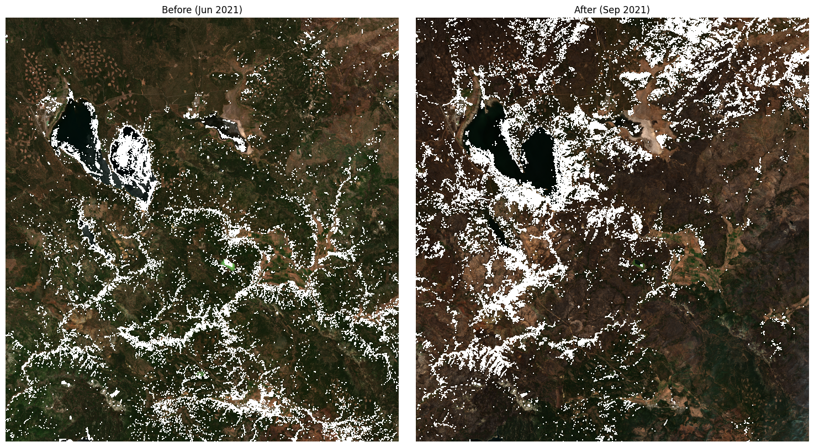
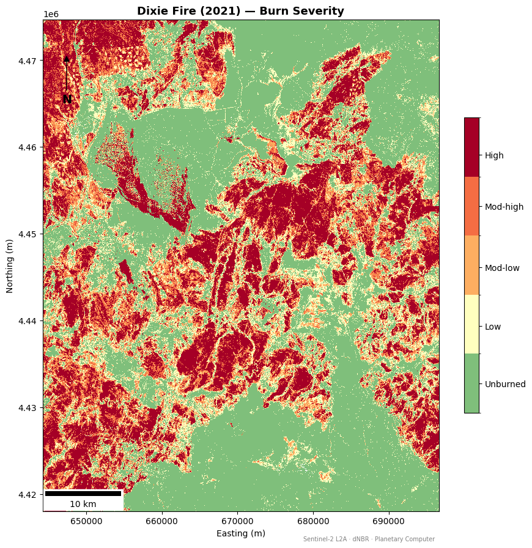

# Wildfire Detection and Burn Severity Mapping FIRMS + Sentinel-2 dNBR

A Jupyter notebook that combines NASA FIRMS real-time active fire data with Sentinel-2 satellite imagery to detect wildfires, track fire spread, and map burn severity using the Differenced Normalized Burn Ratio (dNBR).

---

## What This Notebook Does

1. **Active fire detection** — pulls live hotspot data from NASA FIRMS across four sensors (VIIRS NOAA-20, VIIRS S-NPP, VIIRS NOAA-21, MODIS NRT) for any configurable region
2. **Fire spread tracking** — maps temporal progression of detections coloured by day since first detection
3. **Pre/post Sentinel-2 imagery** — retrieves cloud-free scenes from Microsoft Planetary Computer before and after the fire
4. **dNBR burn severity** — computes Differenced Normalized Burn Ratio (NBR_pre − NBR_post) with cloud/shadow masking via the SCL band
5. **Severity classification** — classifies pixels into five USGS severity classes (Unburned → High)
6. **Relativized Burn Ratio (RBR)** — normalises dNBR by pre-fire NBR for more comparable results across vegetation types
7. **Area statistics** — calculates burned area in hectares per severity class
8. **GeoTIFF export** — saves the dNBR raster for use in QGIS / ArcGIS

**Case study:** Dixie Fire, California, USA (2021) — one of the largest wildfires in California history (~390,000 ha)

---

## Data Sources

| Source | Product | Purpose |
|---|---|---|
| NASA FIRMS | VIIRS NOAA-20/21, VIIRS S-NPP, MODIS NRT | Real-time active fire detections |
| Microsoft Planetary Computer | Sentinel-2 L2A | Pre- and post-fire surface reflectance |
| USGS | dNBR severity thresholds | Burn severity classification |

---

## Burn Severity Classification (USGS)

| Class | dNBR range | Colour |
|---|---|---|
| Unburned | < 0.1 | Green |
| Low | 0.1 – 0.27 | Yellow |
| Moderate-Low | 0.27 – 0.44 | Orange |
| Moderate-High | 0.44 – 0.66 | Red-orange |
| High | > 0.66 | Dark red |

---

## Results — Dixie Fire (2021)

### Before vs After — Sentinel-2 True Colour



> Sentinel-2 true-colour composites (B04/B03/B02) for the Dixie Fire study area. **Left:** pre-fire scene (June 28, 2021, 0 % cloud cover). **Right:** post-fire scene (September 21, 2021, 0 % cloud cover). The dramatic darkening across the landscape in the post-fire image reflects extensive vegetation loss and exposed burnt soil.

---

### Final Burn Severity Map — dNBR



> Cartographic burn severity map of the Dixie Fire derived from cloud/shadow-masked Sentinel-2 dNBR (NBR_pre − NBR_post). High-severity burn (dark red) dominates the north and east of the fire perimeter. The scale bar and north arrow are included for spatial reference. Data: Sentinel-2 L2A via Microsoft Planetary Computer.

**Burned area by severity class:**

| Class | Area (ha) |
|---|---|
| Unburned | 104,031 |
| Low | 41,397 |
| Moderate-Low | 28,726 |
| Moderate-High | 33,358 |
| **High** | **64,160** |

---

## Requirements

```bash
pip install requests pandas geopandas folium matplotlib contextily \
            pystac-client planetary-computer odc-stac rioxarray xarray \
            matplotlib-scalebar
```

A free [NASA Earthdata / FIRMS API key](https://firms.modaps.eosdis.nasa.gov/api/area/) is required for the active fire data pull.

---

## Configurable Regions

Switch the study area by changing `BBOX` in Cell 2:

```python
REGIONS = {
    "canada_boreal": [-125, 52, -114, 60],
    "west_us":       [-124, 36, -118, 42],
    "siberia":       [  95, 58, 140,  70],
    "greece_med":    [  20, 37,  28,  41],
    "australia_se":  [ 145,-38, 152, -32],
}
BBOX = REGIONS["canada_boreal"]  # change here
```

---

## Repository Structure

```
.
├── wildfire-firms.ipynb             # Full analysis notebook
├── README.md
└── images/
    ├── 05_before_after_comparison.png
    └── 11_cartographic_severity_map.png
```
